**Лучше всего открывать в режиме preview в VSCode с загруженной папкой images**

# EDA

Сильно углубляться в EDA не будем, так как цель - сравнить подходы к uplift-моделированиию. Проверим только базовые пункты перед обучением моделей:

- Посмотрим на фичи в датасете
- Посмотрим распределение test/control и target
- Оценим базовый uplift
- Проверем гомогенность разбиения test/control
- Проверим и обработаем NaN

## Описание датасета

Данные о покупках, активности клиентов Ленты и результатах маркетинговых кампаний

Treatment - смс-пуш с промоакцией

Всего 687К строк

Источник: BigTarget by Lenta and Microsoft, 2020.

Подробнее: [Lenta Dataset sklift](https://www.uplift-modeling.com/en/latest/api/datasets/fetch_lenta.html#lenta-uplift-modeling-dataset)

<table style="width:100%; border-collapse: collapse;">

<thead>
<tr>
<th style="width:22%; text-align:left; padding:10px; border-bottom:2px solid #ccc;">
Группа
</th>

<th style="width:43%; text-align:left; padding:10px; border-bottom:2px solid #ccc;">
Фичи
</th>

<th style="width:35%; text-align:left; padding:10px; border-bottom:2px solid #ccc;">
Описание
</th>
</tr>
</thead>

<tbody>

<tr>
<td valign="top" style="padding:12px;">
<b>ID и базовая инфа</b>
</td>

<td valign="top" style="padding:12px; line-height:1.9;">
<code>CardHolder</code><br>
<code>age</code><br>
<code>gender</code><br>
<code>children</code><br>
<code>months_from_register</code><br>
<code>main_format</code>
</td>

<td valign="top" style="padding:12px;">
Идентификатор клиента и базовые характеристики: возраст, пол, дети, стаж, тип магазина
</td>
</tr>

<tr>
<td valign="top" style="padding:12px;">
<b>Таргет и эксперимент</b>
</td>

<td valign="top" style="padding:12px; line-height:1.9;">
<code>response_att</code><br>
<code>group</code>
</td>

<td valign="top" style="padding:12px;">
Целевая переменная (визит) и флаг treatment/control
</td>
</tr>

<tr>
<td valign="top" style="padding:12px;">
<b>Коммуникации (история откликов)</b>
</td>

<td valign="top" style="padding:12px; line-height:1.9;">
<code>response_sms</code><br>
<code>response_viber</code>
</td>

<td valign="top" style="padding:12px;">
Доля откликов на прошлые коммуникации
</td>
</tr>

<tr>
<td valign="top" style="padding:12px;">
<b>Покупательская активность (RFM-like)</b>
</td>

<td valign="top" style="padding:12px; line-height:1.9;">
<code>cheque_count_[3,6,12]m_g*</code><br>
<code>sale_count_[3,6,12]m_g*</code><br>
<code>sale_sum_[3,6,12]m_g*</code>
</td>

<td valign="top" style="padding:12px;">
Частота покупок, количество товаров и выручка по группам товаров
</td>
</tr>

<tr>
<td valign="top" style="padding:12px;">
<b>Промо / скидки (уровень)</b>
</td>

<td valign="top" style="padding:12px; line-height:1.9;">
<code>disc_sum_6m_g34</code><br>
<code>mean_discount_depth_15d</code><br>
<code>promo_share_15d</code><br>
<code>food_share_[15d,1m]</code>
</td>

<td valign="top" style="padding:12px;">
Объем скидок, глубина скидок, доля промо и структура покупок
</td>
</tr>

<tr>
<td valign="top" style="padding:12px;">
<b>Промо-поведение (crazy campaigns)</b>
</td>

<td valign="top" style="padding:12px; line-height:1.9;">
<code>crazy_purchases_cheque_count_[1,3,6,12]m</code><br>
<code>crazy_purchases_goods_count_[6,12]m</code>
</td>

<td valign="top" style="padding:12px;">
Активность клиента в “агрессивных” промо
</td>
</tr>

<tr>
<td valign="top" style="padding:12px;">
<b>Поведение визитов</b>
</td>

<td valign="top" style="padding:12px; line-height:1.9;">
<code>k_var_days_between_visits_[15d,1m,3m]</code><br>
<code>stdev_days_between_visits_15d</code><br>
<code>perdelta_days_between_visits_15_30d</code>
</td>

<td valign="top" style="padding:12px;">
Регулярность и паттерны посещений
</td>
</tr>

<tr>
<td valign="top" style="padding:12px;">
<b>Размер и состав чека</b>
</td>

<td valign="top" style="padding:12px; line-height:1.9;">
<code>k_var_cheque_[15d,3m]</code><br>
<code>k_var_count_per_cheque_[15d,1m,3m,6m]_g*</code><br>
<code>k_var_sku_per_cheque_15d</code>
</td>

<td valign="top" style="padding:12px;">
Вариативность размера чека и количества товаров
</td>
</tr>

<tr>
<td valign="top" style="padding:12px;">
<b>Разнообразие покупок</b>
</td>

<td valign="top" style="padding:12px; line-height:1.9;">
<code>k_var_cheque_category_width_15d</code><br>
<code>k_var_cheque_group_width_15d</code>
</td>

<td valign="top" style="padding:12px;">
Разнообразие категорий и групп в корзине
</td>
</tr>

<tr>
<td valign="top" style="padding:12px;">
<b>Цены и скидки (вариативность)</b>
</td>

<td valign="top" style="padding:12px; line-height:1.9;">
<code>k_var_disc_per_cheque_15d</code><br>
<code>k_var_disc_share_[15d,1m,3m,6m,12m]_g*</code><br>
<code>k_var_discount_depth_[15d,1m]</code><br>
<code>stdev_discount_depth_[15d,1m]</code><br>
<code>k_var_sku_price_12m_g*</code>
</td>

<td valign="top" style="padding:12px;">
Насколько нестабильны цены и скидки
</td>
</tr>

</tbody>
</table>

## Распределение treatment и target. Общий uplift

<p align="center">
  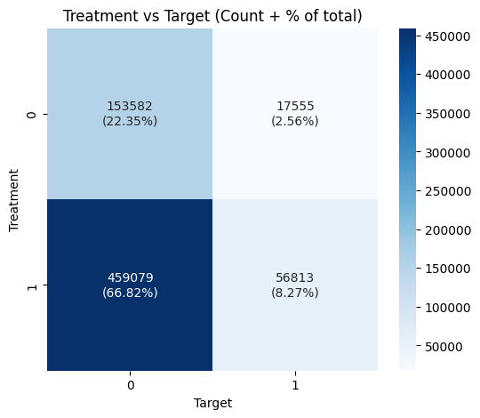
  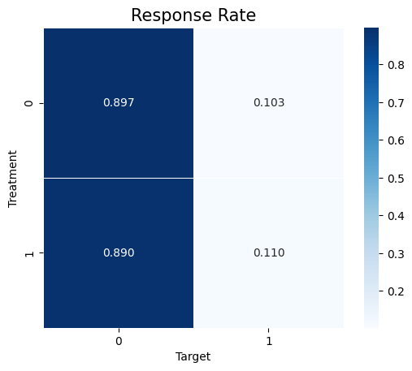
</p>

**Выводы:**

Соотношение Test/Control: 75/25

Разница в Response Rate (Общий Uplift) по датасету: +0.7%

Доверительный интервал для uplift: [+0.6%, +0.9%]

## Распределение признаков в test/control

Далее сравним распредления признаков в контроле и тесте, чтобы убедиться, что разбиение гомогенное

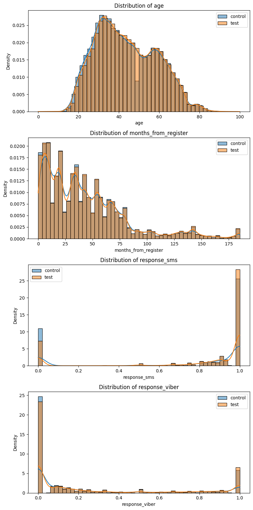

| feature | type | control | test | abs_diff | relative_diff | std_diff |
|---|---|---:|---:|---:|---:|---:|
| `response_sms` | numeric | 0.726143 | 0.800636 | 0.074493 | 0.102588 | 0.197907 |
| `response_viber` | numeric | 0.250909 | 0.276202 | 0.025293 | 0.100805 | 0.068491 |
| `k_var_count_per_cheque_1m_g34` | numeric | 0.210156 | 0.218477 | 0.008320 | 0.039591 | 0.025344 |
| `crazy_purchases_cheque_count_12m` | numeric | 2.406271 | 2.520365 | 0.114094 | 0.047415 | 0.024931 |
| `crazy_purchases_goods_count_12m` | numeric | 4.037707 | 4.243799 | 0.206092 | 0.051042 | 0.024411 |
| `...` | `...` | `...` | `...` | `...` | `...` | `...` |
| `cheque_count_3m_g56` | numeric | 0.596929 | 0.598100 | 0.001170 | 0.001960 | 0.000849 |
| `sale_sum_12m_g27` | numeric | 1304.190841 | 1300.203103 | -3.987739 | -0.003058 | -0.000661 |
| `cheque_count_6m_g40` | numeric | 4.199185 | 4.180541 | -0.018644 | -0.004440 | -0.001988 |
| `main_format` | binary | 0.103560 | 0.100498 | -0.003063 | -0.029572 | -0.010118 |
| `gender` | binary | 0.369625 | 0.356926 | -0.012698 | -0.034355 | -0.026403 |

Видим что по standardized difference выделяется признак response_sms. Можем посмотреть uplift в бинах по этому признаку

| feature | feature_bin | n_control | n_test | response_control | response_test | uplift | n_total |
|---|---|---:|---:|---:|---:|---:|---:|
| `response_sms` | `(-0.001, 0.667]` | 45311 | 96824 | 0.084924 | 0.084173 | -0.000751 | 142135 |
| `response_sms` | `(0.667, 0.917]` | 32201 | 104674 | 0.120959 | 0.127357 | 0.006398 | 136875 |
| `response_sms` | `(0.917, 1.0]` | 91539 | 307899 | 0.103333 | 0.111001 | 0.007668 | 399438 |

Видим что общий uplift +0.7 п.п. сохраняется при response_sms > 0.67. При меньшем его практически нет. Можно предположить, что клиенты с долей реакций на смс ниже этого порога в целом не будут реагировать на treatment

| feature | feature_bin | n_control | n_test | response_control | response_test | uplift | n_total |
|---|---|---:|---:|---:|---:|---:|---:|
| `months_from_register` | `(-0.001, 11.0]` | 37478 | 112168 | 0.092534 | 0.099520 | 0.006986 | 149646 |
| `months_from_register` | `(11.0, 27.0]` | 30766 | 92589 | 0.098193 | 0.105585 | 0.007392 | 123355 |
| `months_from_register` | `(27.0, 44.0]` | 35427 | 106276 | 0.098569 | 0.105330 | 0.006761 | 141703 |
| `months_from_register` | `(44.0, 67.0]` | 32835 | 99055 | 0.103152 | 0.108233 | 0.005081 | 131890 |
| `months_from_register` | `(67.0, 185.0]` | 32545 | 99309 | 0.117806 | 0.128931 | 0.011125 | 131854 |

У старичков в сервисе (>5 лет в сервисе) uplift выше в 2 раза, чем у других. При этом таких клиентов 20% от всей базы. Возможно попали в сегмент лояльных покупателей

| feature | feature_bin | n_control | n_test | response_control | response_test | uplift | n_total |
|---|---|---:|---:|---:|---:|---:|---:|
| `crazy_purchases_cheque_count_3m` | `(-0.001, 1.0]` | 150184 | 449462 | 0.081473 | 0.087396 | 0.005922 | 599646 |
| `crazy_purchases_cheque_count_3m` | `(1.0, 277.0]` | 20953 | 66430 | 0.253854 | 0.263917 | 0.010063 | 87383 |

| feature | feature_bin | n_control | n_test | response_control | response_test | uplift | n_total |
|---|---|---:|---:|---:|---:|---:|---:|
| `crazy_purchases_goods_count_12m` | `(-0.001, 1.0]` | 92932 | 273777 | 0.058774 | 0.063102 | 0.004328 | 366709 |
| `crazy_purchases_goods_count_12m` | `(1.0, 2.0]` | 16228 | 48279 | 0.097856 | 0.101576 | 0.003721 | 64507 |
| `crazy_purchases_goods_count_12m` | `(2.0, 6.0]` | 31111 | 95694 | 0.129183 | 0.132913 | 0.003731 | 126805 |
| `crazy_purchases_goods_count_12m` | `(6.0, 1047.0]` | 30866 | 98142 | 0.210134 | 0.223289 | 0.013155 | 129008 |

Видим что клиенты, активно участвовавшие в crazy-промо (>1 покупки за 3мес, >6 товаров за год) имеют uplift в 2-3 раза выше чем остальные. Возможно нашли еще один чувствительный к промо-акциям сегмент

## Пропущенные значения

Далее смотрим пропущенные значения и сравниваем test/control по их количеству

Доля NaN по признакам:

| Признак | Доля NaN |
|---|---:|
| `k_var_sku_price_15d_g49` | 0.722326 |
| `k_var_disc_share_15d_g49` | 0.722181 |
| `k_var_count_per_cheque_15d_g34` | 0.681996 |
| `k_var_sku_price_15d_g34` | 0.681996 |
| `k_var_disc_share_15d_g34` | 0.681874 |
| `...` | `...` |
| `cheque_count_6m_g58` | 0.004534 |
| `cheque_count_6m_g57` | 0.004534 |
| `disc_sum_6m_g34` | 0.004534 |
| `cheque_count_6m_g52` | 0.004534 |
| `crazy_purchases_goods_count_6m` | 0.000001 |


Сравниваем долю NaN в test и control

| feature | missing_control | missing_test | diff |
|---|---:|---:|---:|
| `k_var_days_between_visits_15d` | 0.109970 | 0.112686 | 0.002716 |
| `stdev_days_between_visits_15d` | 0.109970 | 0.112686 | 0.002716 |
| `k_var_days_between_visits_1m` | 0.131982 | 0.134329 | 0.002347 |
| `k_var_sku_price_6m_g42` | 0.236430 | 0.238286 | 0.001856 |
| `k_var_discount_depth_15d` | 0.203118 | 0.204872 | 0.001754 |
| `...` | `...` | `...` | `...` |
| `k_var_disc_share_3m_g27` | 0.344449 | 0.337838 | -0.006611 |
| `k_var_sku_price_3m_g27` | 0.344607 | 0.337941 | -0.006666 |
| `k_var_count_per_cheque_3m_g27` | 0.344607 | 0.337941 | -0.006666 |
| `k_var_disc_share_3m_g49` | 0.378521 | 0.371221 | -0.007300 |
| `k_var_sku_price_3m_g49` | 0.378632 | 0.371324 | -0.007308 |

По доле NaN в признаках тест и контроль не отличаются. В контексте истории покупок и активности пользователя можно NaN заполнить нулями

## Разбиение данных перед обучением

Обучение: 70% (481К)

Тест для сравнения моделей: 15% (103К)

Ходаут датасет для симуляции среды в приложении: 15% (103К)

Стратифицируем по target и treatment одновременно

# Сравнение моделей

Сравним между собой различные модели и подходы к uplift моделированию. Учим каждую модель на всём train, оцениваем качество на test. На данном этапе все гиперпараметры базовых моделей (catboost) фиксированы, тюнить будем только у лучших кандидатов.

## Тестируемые модели:

| Уровень | Модель |
|---|---|
| 0. Baseline | Random |
| 0. Baseline | Response Model |
| 1. Базовые подходы | S-Learner |
| 1. Базовые подходы | T-Learner |
| 1. Базовые подходы | Class Transformation |
| 2. Продвинутые подходы | Transformed Outcome |
| 2. Продвинутые подходы | X-Learner |
| 2. Продвинутые подходы | DR-Learner |
| 2. Продвинутые подходы | Uplift Random Forest |
| 3. Deep Learning | TARNet |
| 3. Deep Learning | CFRNet + MMD Loss |
| 3. Deep Learning | DragonNet |

## Метрики

### Основные uplift-метрики

Отталкиваемся от задачи - выделить сегмент пользователей (размер может меняться), который покажет наибольший uplift при запуске акции. Для этого подойдут метрики, больше опирающиеся на качество ранжирования на основе скора модели

| Метрика | Описание |
|---|---|
| `uplift@5` | Средний uplift на топ-5% клиентов с максимальным предсказанным uplift |
| `uplift@10` | Средний uplift на топ-10% клиентов |
| `uplift@30` | Средний uplift на топ-30% клиентов |
| `Qini AUC` | Площадь под Qini curve, характеризует качество ранжирования uplift |
| `Uplift AUC` | Площадь под uplift curve |


### Оценка ожидаемой прибыли

Чтобы использование моделей было вообще целесообразно, полезно оценить прибыль от акций, запущенных на основе скоринга моделей

**Формулы расчета прибыли**

```python
incremental_visits = uplift * n_selected
gross_profit = incremental_visits * value_per_visit
communication_cost = n_selected * contact_cost
profit = gross_profit - communication_cost
```

Где:

- `uplift` — средний uplift на выбранном сегменте
- `n_selected` — количество клиентов в сегменте
- `value_per_visit` — средняя прибыль с одного дополнительного визита
- `contact_cost` — стоимость коммуникации с одним клиентом

| Параметр | Значение | Комментарий |
|---|---|---|
| Treatment cost | 15 руб. | Стоимость отправки смс-промо |
| Value per visit | 500 руб. | Средний чек с учетом скидки |
| Break-even uplift | 15/500 = 3% | Uplift выше которого выйдем в + |

Получается, чтобы заработать на промоакции, нужно выделить сегмент пользователей, uplift в котором будет в ~7 раз выше чем по всем клиентам в базе

### Profit метрики

| Метрика | Описание |
|---|---|
| `profit@5` | Ожидаемая прибыль при коммуникации с топ-5% клиентов |
| `profit@10` | Ожидаемая прибыль при коммуникации с топ-10% клиентов |
| `profit@30` | Ожидаемая прибыль при коммуникации с топ-30% клиентов |

## Baseline

### Random model

Выбираем случайную подвыборку для uplift

В рандоме uplift получается около 1%, AUC близки к нулю

<table>
<tr>
<td valign="top">

| Метрика | Значение |
|---|---:|
| `uplift@5` | `0.01346` |
| `uplift@10` | `0.01246` |
| `uplift@30` | `0.01053` |
| `Qini AUC` | `-0.00267` |
| `Uplift AUC` | `-0.00148` |
| `profit@5` | `-42597.80` |
| `profit@10` | `-90378.46` |
| `profit@30` | `-301004.05` |

</td>

<td valign="top">

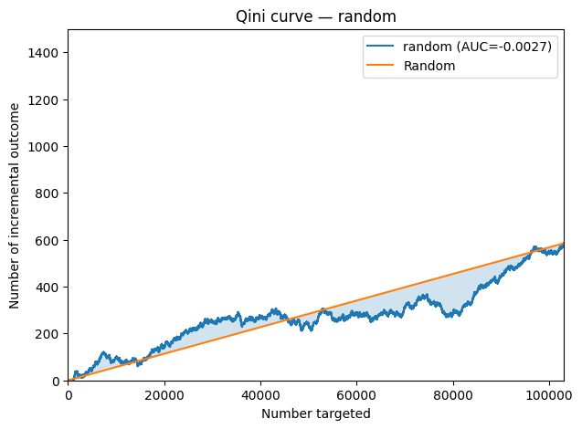

</td>

<td valign="top">

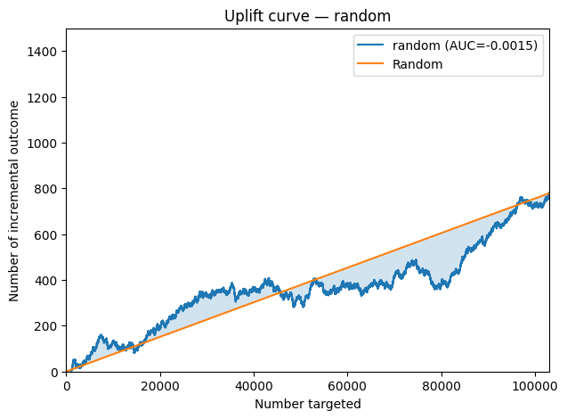

</td>

</tr>
</table>

### Response Model

Предсказываем вероятность целевого действия обычнычным классификатором, никак не учитываем treatment

Нужна как бейзлайн чтобы проверить, что treatment вообще на что-то влияет

Видим что уже можем получить uplift около 1% только на основе фичей

<table>
<tr>
<td valign="top">

| Метрика | Значение |
|---|---:|
| `uplift@5` | `0.01863` |
| `uplift@10` | `0.02232` |
| `uplift@30` | `0.01114` |
| `Qini AUC` | `0.00944` |
| `Uplift AUC` | `0.00513` |
| `profit@5` | `-29280.00` |
| `profit@10` | `-39590.69` |
| `profit@30` | `-291595.60` |

</td>

<td valign="top">

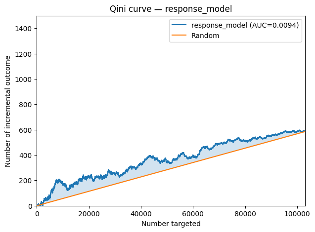

</td>

<td valign="top">

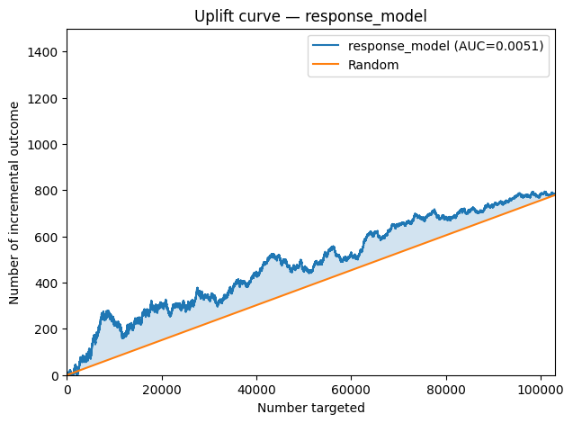

</td>

</tr>
</table>

## Базовые подходы

### S-Learner

Учим одну модель c Treatment как бинарная фича

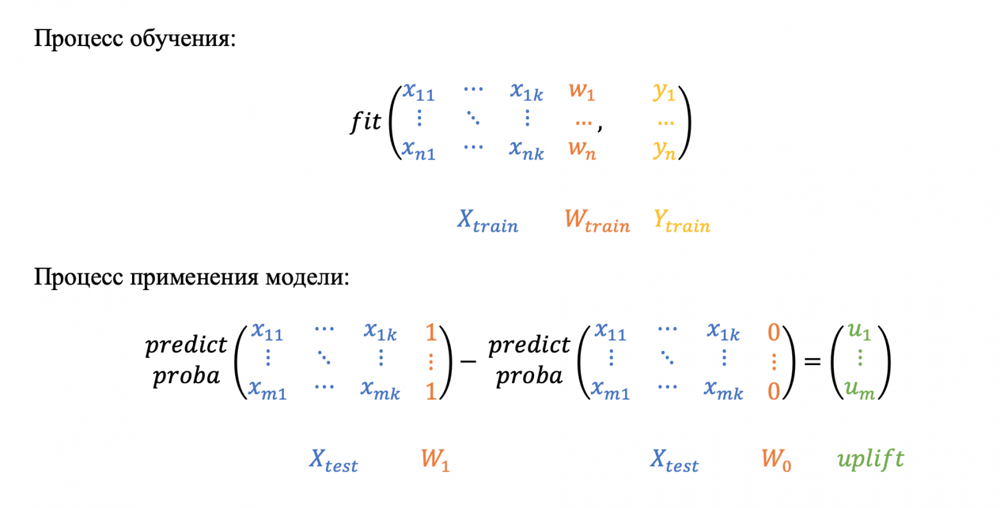

Результаты уже немного лучше, даже получилось выйти в прибыль на лучших 10%

<table>
<tr>
<td valign="top">

| Метрика | Значение |
|---|---:|
| `uplift@5` | `0.02020` |
| `uplift@10` | `0.03244` |
| `uplift@30` | `0.01155` |
| `Qini AUC` | `0.01903` |
| `Uplift AUC` | `0.01037` |
| `profit@5` | `-25243.40` |
| `profit@10` | `12549.52` |
| `profit@30` | `-285196.03` |

</td>

<td valign="top">

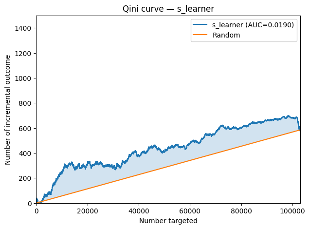

</td>

<td valign="top">

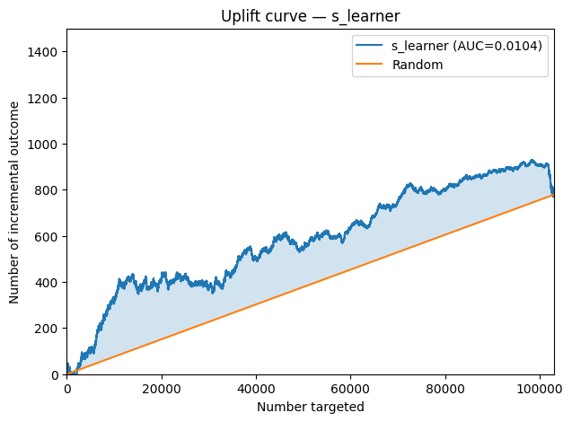

</td>

</tr>
</table>

### T-Learner

Учим две разные модели на Test и Control, далее каждой из них скорим выборку и считаем uplift как разность предсказаний

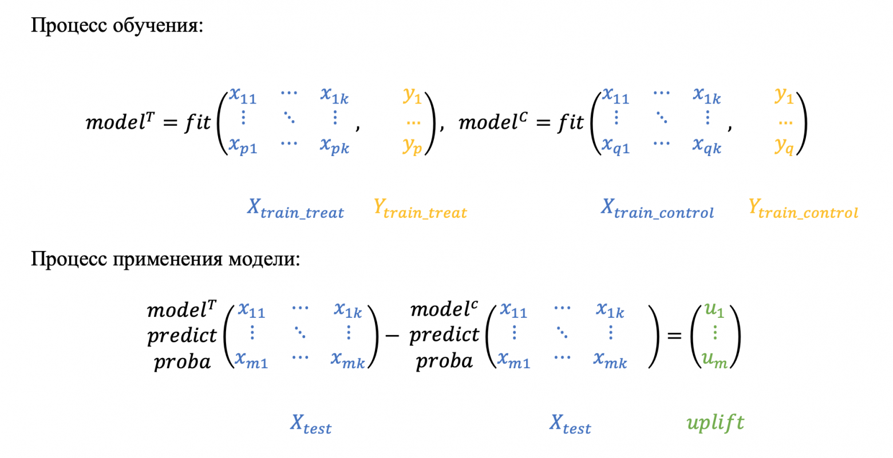


Видим что T-Learner хуже ранжирует верх и у него ошибка больше чем у S-Learner. Это может быть связано с:

- Обе модели учатся независимо и их ошибки суммируются

- Размер выборки для модели контроля недостаточно большой, чтобы модель на основе него хорошо предсказывала весь датасет

<table>
<tr>
<td valign="top">

| Метрика | Значение |
|---|---:|
| `uplift@5` | `0.00380` |
| `uplift@10` | `0.00929` |
| `uplift@30` | `0.01227` |
| `Qini AUC` | `0.01323` |
| `Uplift AUC` | `0.00720` |
| `profit@5` | `-67495.82` |
| `profit@10` | `-106703.54` |
| `profit@30` | `-274012.41` |

</td>

<td valign="top">

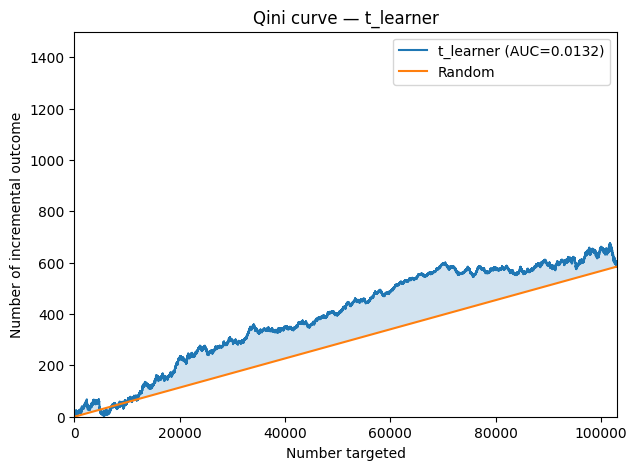

</td>

<td valign="top">

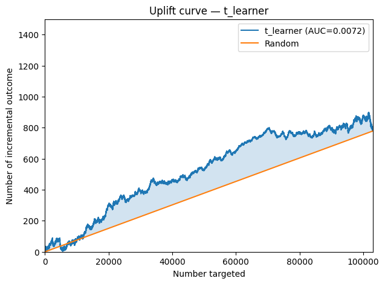

</td>

</tr>
</table>


### Class Transformation (Binary)

Создаем новый таргет следующим образом и учим классификатор на него

$$
Z_i =
\begin{cases}
1, & \text{если } W_i = 1 \text{ и } Y_i = 1 \\
1, & \text{если } W_i = 0 \text{ и } Y_i = 0 \\
0, & \text{в остальных случаях}
\end{cases}
$$

Результаты значительно выше предыдущих подходов. При этом стоит учесть, что в данном подходе для интерпретируемости предсказаний как uplift нужно соотношение test/control = 50/50, а у нас 75/25

- Тем не менее дисбаланс классов частично учитывался при пересчете sample_weight, чего не было в прошлых моделях

- Свели задачу к бинарной классификации для типа клиентов, больше всего влияющих на uplift (убеждаемый / не убеждаемый). При этом обучение происходит на всех данных (в отличие от T-Learner)

- Важно что выбранные метрики отражают качество ранжирования, а не точно предсказанный uplift. Поэтому модель могла хорошо отранжировать клиентов, несмотря на то что ее предикты - это не чистый uplift из за дисбаланса. Это нужно учитывать - модель используем для ранкинга

- У топ-5% ранжирование хуже чем при более крупном сегменте. Но на 10 и 30 процентах модель сильно лучше, из за чего и AUC у нее выше тк он считается по всем размерам сегментов

<table>
<tr>
<td valign="top">

| Метрика | Значение |
|---|---:|
| `uplift@5` | `-0.00670` |
| `uplift@10` | `0.04625` |
| `uplift@30` | `0.02768` |
| `Qini AUC` | `0.03251` |
| `Uplift AUC` | `0.01951` |
| `profit@5` | `-94539.40` |
| `profit@10` | `83731.05` |
| `profit@30` | `-35883.09` |

</td>

<td valign="top">

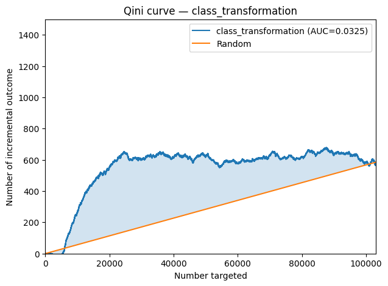

</td>

<td valign="top">

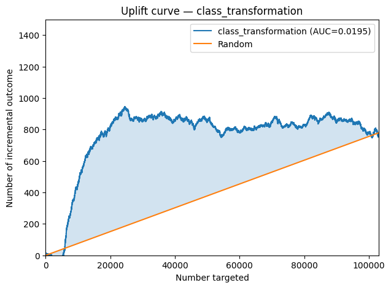

</td>

</tr>
</table>

## Продвнутые подходы

### Transformed Outcome (Regression)

В этом подходе тоже делаем трансформацию классов, только с учетом реального соотношения test/control. Таргет уже не бинарная фича как в предыдущем подходе

$ Z_i = Y_i \frac{W_i - p}{p(1 - p)} $

Тут уже была корректно учтена доля test/control, но модель сильно хуже. В частности это происходит из за:

- Более шумного таргета в задаче регрессии, при доле классов 75/20 получаем значения таргета от -4 до 1.33. При доле положительного таргета во всем датасете ~0.1, модель будет выдавать прогнозы ближе к 0

- В частности для метрик на основе ранжирования такой разброс плох. Даже если мы более точно оценили сам uplift

<table>
<tr>
<td valign="top">

| Метрика | Значение |
|---|---:|
| `uplift@5` | `0.01205` |
| `uplift@10` | `0.00196` |
| `uplift@30` | `0.00727` |
| `Qini AUC` | `0.00050` |
| `Uplift AUC` | `-0.00021` |
| `profit@5` | `-46229.58` |
| `profit@10` | `-144487.33` |
| `profit@30` | `-351348.48` |

</td>

<td valign="top">

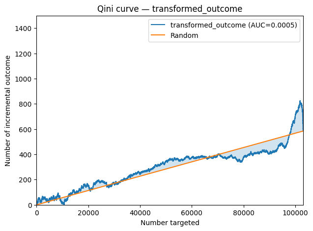

</td>

<td valign="top">

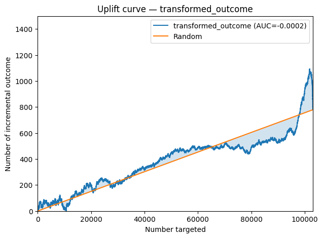

</td>

</tr>
</table>

### X-Learner

Обучаем две зависимые модели на test/control. Учим новые модели на основе ошибок предсказания модели в противоположной группе. То есть подход аналогичный T-Learner, но учим дополнительно модели хорошо предсказывать не только на test/control, но и на другом классе тоже

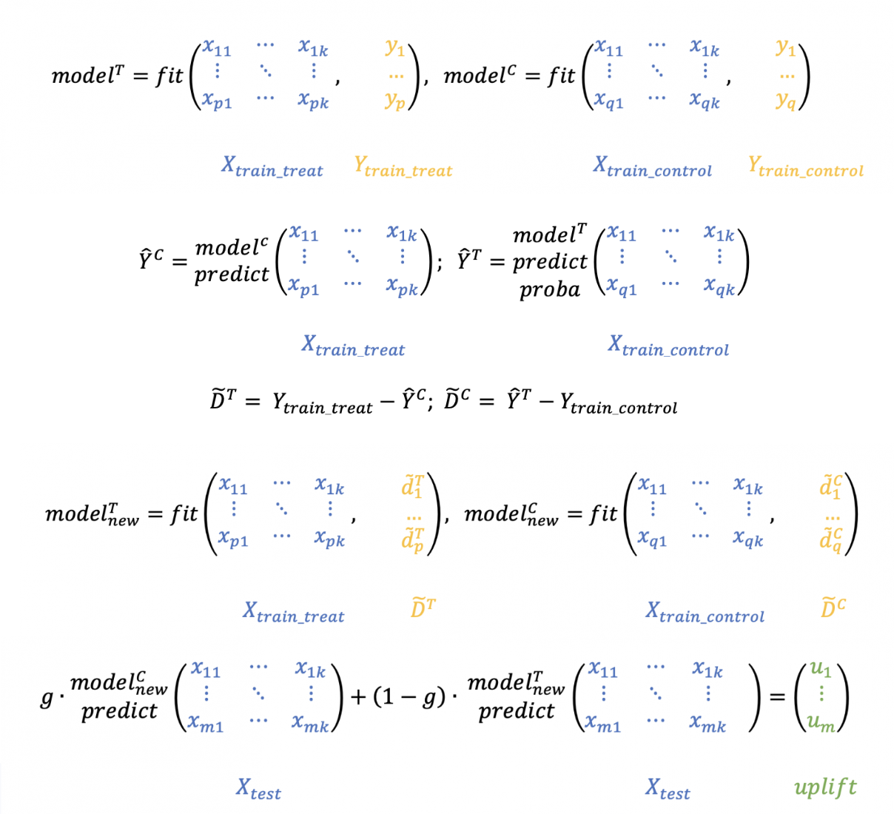


Результаты почти как у рандомной модели. Это может быть связано с:

- Pseudo-uplift на котором учим вторые модели мог быть слишком зашумлен из за низкого базового uplift по всему датасету (0.007) и большой ошибки моделей обученных на test/control (дизбаланс классов)

- В связи с маленькими по модулю значениями uplift (и предсказанных и реальных), модель учит разность между двумя близкими околонулевыми вероятностями, в дополнении с шумом это может не дать никакого эффекта, тк разница слишком мала

<table>
<tr>
<td valign="top">

| Метрика | Значение |
|---|---:|
| `uplift@5` | `0.01297` |
| `uplift@10` | `-0.00184` |
| `uplift@30` | `0.01194` |
| `Qini AUC` | `0.00338` |
| `Uplift AUC` | `0.00181` |
| `profit@5` | `-43879.81` |
| `profit@10` | `-164036.28` |
| `profit@30` | `-279162.80` |

</td>

<td valign="top">

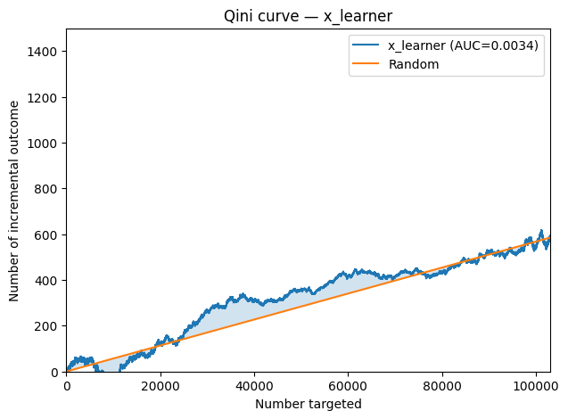

</td>

<td valign="top">

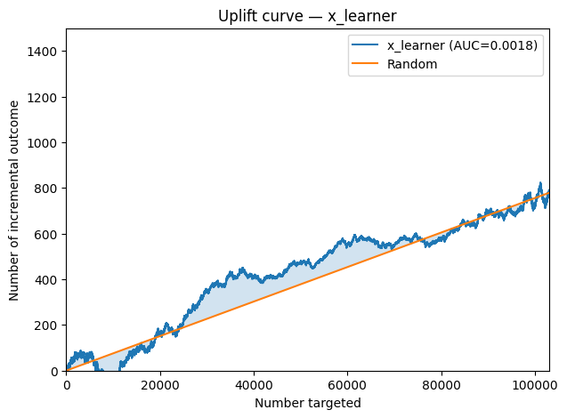

</td>

</tr>
</table>

### DR-Learner

Идея: используем T-Learner как основу, но при расчете uplift делаем поправку на ошибку с учетом баланса классов.

В T-Learner:

$uplift = Model^T (X) - Model^C (X)$

Добавляем поправку ошибки:

Для объектов из treatment-группы (`W = 1`):

$$
W \cdot \frac{Y - Model^T(X)}{P(W = 1 \mid X)}
$$

Для объектов из control-группы (`W = 0`):

$$ (1 - W) \cdot \frac{Y - Model^C(X)}{P(W = 0 \mid X)} $$

**Итоговая формула uplift**

$$ uplift(X) = Model^T(X) - Model^C(X)+ W \cdot \frac{Y - Model^T(X)}{P(W = 1 \mid X)} -(1 - W) \cdot \frac{Y - Model^C(X)}{P(W = 0 \mid X)} $$

Где:

- $Model^T(X)$ — prediction outcome-модели для treatment
- $Model^C(X)$ — prediction outcome-модели для control
- $P(W = 1 \mid X)$ — propensity score
- $Y$ — фактический target
- $W$ — treatment-флаг

Получили лучший результат на топ-5% клиентов. Модель хорошо нашла узкий сегмент с очень высоким uplift. Но при увеличении размера сегмента качество падает

<table>
<tr>
<td valign="top">

| Метрика | Значение |
|---|---:|
| `uplift@5` | `0.04567` |
| `uplift@10` | `0.01923` |
| `uplift@30` | `0.01134` |
| `Qini AUC` | `0.00834` |
| `Uplift AUC` | `0.00453` |
| `profit@5` | `40368.37` |
| `profit@10` | `-55505.70` |
| `profit@30` | `-288408.32` |

</td>

<td valign="top">

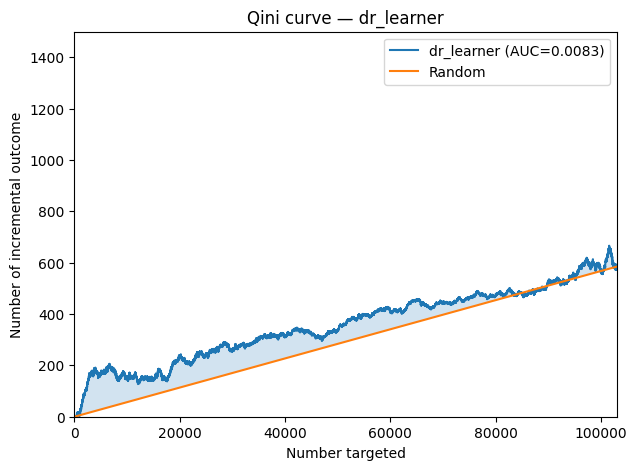

</td>

<td valign="top">

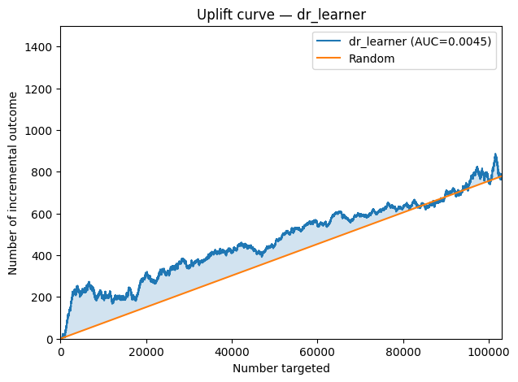

</td>

</tr>
</table>

### Uplift Random Forest

Тут мы учим классический random forest, только критерием разбиения в ноде выступает не энтропия, а uplift посчитанный на основе двух получившихся групп. Таким образом мы строим каждое дерево так, чтобы максимизировать uplift. При этом мы учитываем, чтобы в листе было больше определенного количества сэмплов

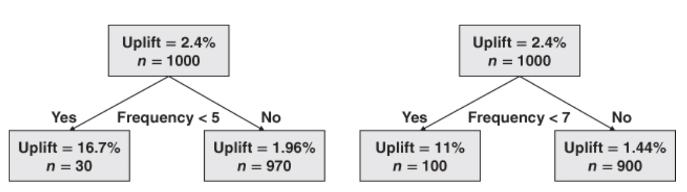


В целом результаты лучше и стабильнее, чем при других подходах. При этом в качестве ранжирования все равно уступаем Class Transformation

- Тут мы строим одну модель на всех данных

- Оптимизируем uplift напрямую, а не через оценки

- Возможно при большем количестве деревьев можно было добиться лучшего качества, но для only-cpu обучения это уже слишком долго

<table>
<tr>
<td valign="top">

| Метрика | Значение |
|---|---:|
| `uplift@5` | `0.03228` |
| `uplift@10` | `0.02257` |
| `uplift@30` | `0.02065` |
| `Qini AUC` | `0.02355` |
| `Uplift AUC` | `0.01314` |
| `profit@5` | `5883.54` |
| `profit@10` | `-38263.25` |
| `profit@30` | `-144493.35` |

</td>

<td valign="top">

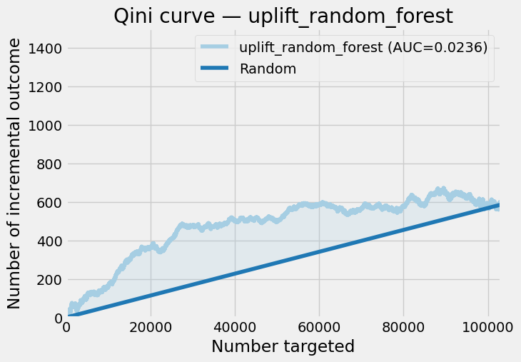

</td>

<td valign="top">

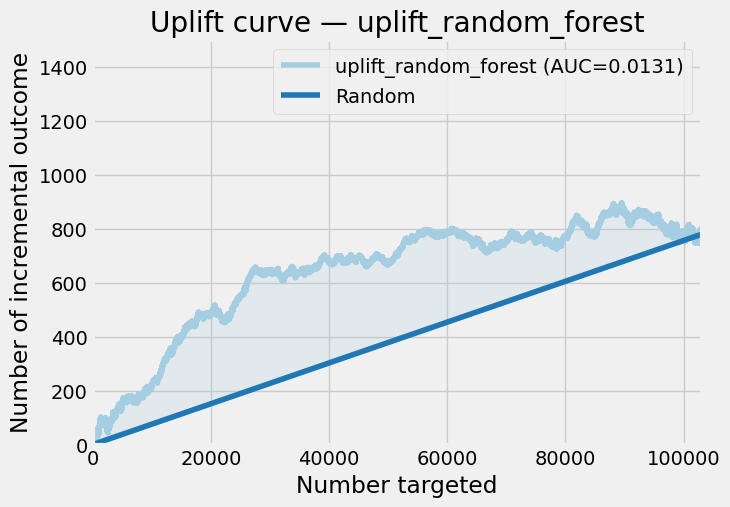

</td>

</tr>
</table>

## Deep Learning подходы

### TARNet

Первые слои нейросети учим на всех данных и на фичах из X. На третьем слое добавляем Treatment-фичу и для Test/Control дальше по отдельности используются свои подслои

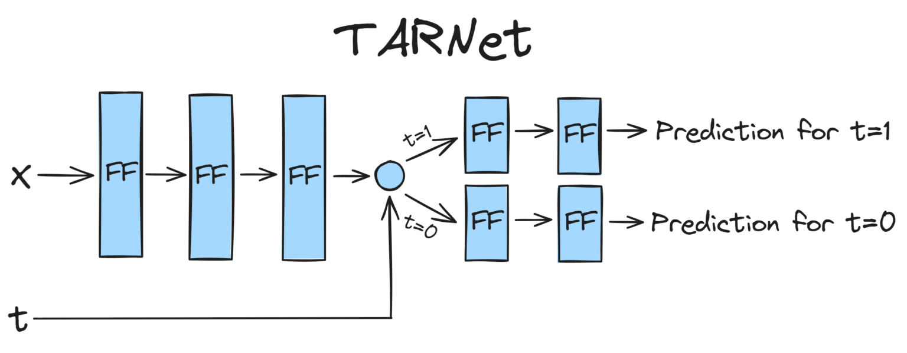

Не получили сильного прироста по сравнению с S-Learner

<table>
<tr>
<td valign="top">

| Метрика | Значение |
|---|---:|
| `uplift@5` | `0.00566` |
| `uplift@10` | `0.00761` |
| `uplift@30` | `0.01302` |
| `Qini AUC` | `0.01168` |
| `Uplift AUC` | `0.00644` |
| `profit@5` | `-62704.32` |
| `profit@10` | `-115343.73` |
| `profit@30` | `-262461.79` |
</td>

<td valign="top">

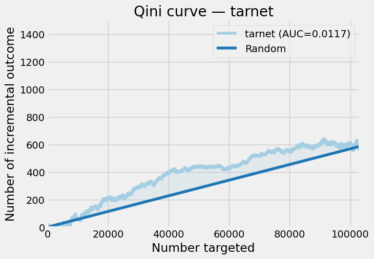

</td>

<td valign="top">

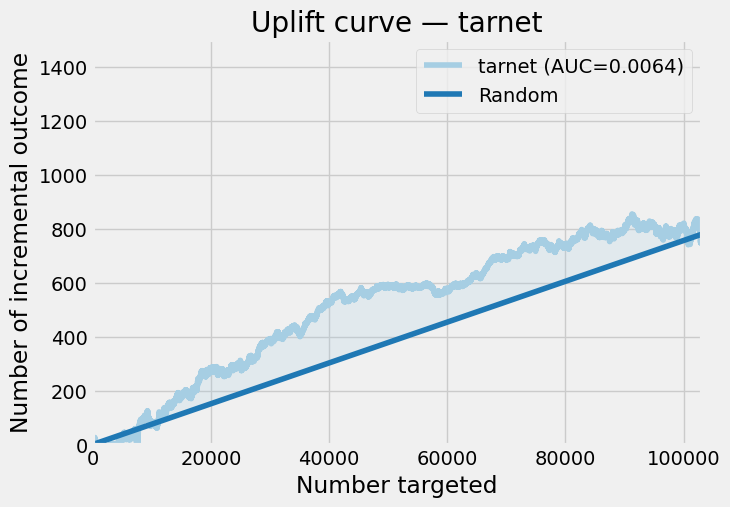

</td>

</tr>
</table>

### CFRNet c MMD Loss

CFRNet - модификация TARNet. Идея та же, только мы хотим, чтобы модель не просто учила различия между Test/Control, а оценивала влияние Treatment-а. Следовательно мы хотим, чтобы модель выучила скрытое представление, в котором Test и Control были бы похожи. Поэтому мы дополнительно штрафуем модель за различия между Test и Control

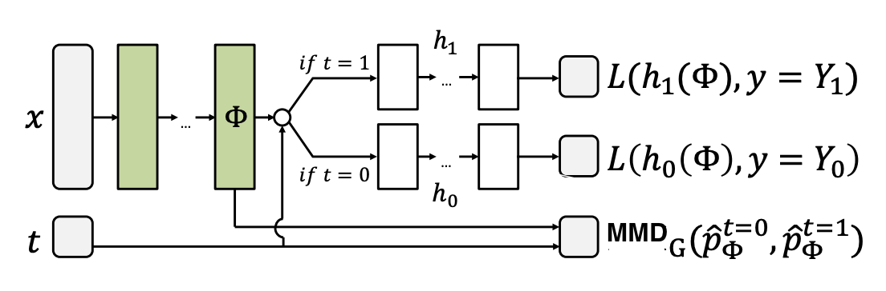


Как штрафуем? Введем дополнительный MMD Loss

$$ MMD^2 = mean( K(Test, Test)) + mean( K(Control, Control)) - 2 \cdot mean( K(Test, Control))$$

$K(a,b)$ - мера схожести двух объектов, в данном случае это RBF-ядро

$$ K(a,b) = e^{- \frac{||a-b||^2 }{2 \sigma^2}} $$

Подход оказался более эффективным. Все еще не такие высокие uplift-ы как у Class Transformation, но выше чем у других моделей и более стабилен при разных top-K. Модель непосредственно учила влияние Treatment-а, это дало прирост к качеству

<table>
<tr>
<td valign="top">

| Метрика | Значение |
|---|---:|
| `uplift@5` | `0.01435` |
| `uplift@10` | `0.02486` |
| `uplift@30` | `0.01580` |
| `Qini AUC` | `0.02453` |
| `Uplift AUC` | `0.01345` |
| `profit@5` | `-40320.46` |
| `profit@10` | `-26492.34` |
| `profit@30` | `-219540.80` |
</td>

<td valign="top">

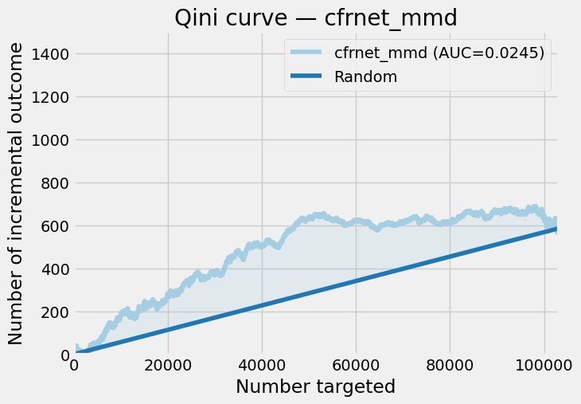

</td>

<td valign="top">

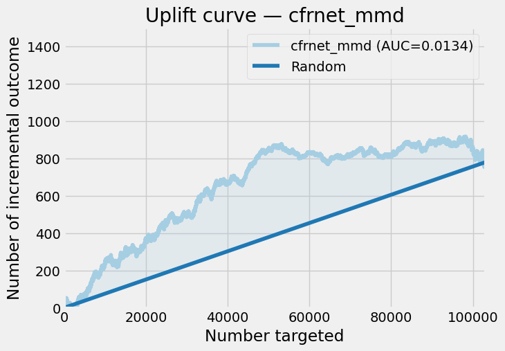

</td>

</tr>
</table>

### DragonNet

Подход наследуется от TARNet, только теперь добавляется третья голова, предсказывающая propensity (вероятность быть отнесенным к Treatment, она же использовалась в DR-Learner)

Модель дополнительно учится понимать, насколько клиент похож на тех, кто попал в Test, какие признаки связаны с фактом получения Treatment. Это может быть полезно при дизбалансе классов или различиях в Test/Control.

К обычному Loss теперь добавлется Propensity Loss, как раз отвечающий за корректное предсказание propensity

И отдельно добавляется Targeted Regularization - поправка к предсказаниям модели с учетом предсказанной propensity

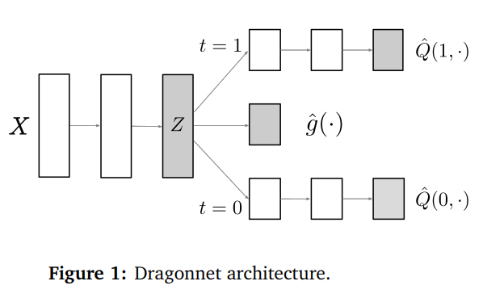

Прироста в качестве не дало. В целом константная оценка propensity=0.75 давала такой же результат, так как сильных различий в признаках у Test и Control не было, следовательно обучение отдельной головы под нахождение этой разности тут не дало эффекта

<table>
<tr>
<td valign="top">

| Метрика | Значение |
|---|---:|
| `uplift@5` | `0.02097` |
| `uplift@10` | `0.02186` |
| `uplift@30` | `0.01211` |
| `Qini AUC` | `0.01073` |
| `Uplift AUC` | `0.00601` |
| `profit@5` | `-23271.61` |
| `profit@10` | `-41935.13` |
| `profit@30` | `-276481.08` |
</td>

<td valign="top">

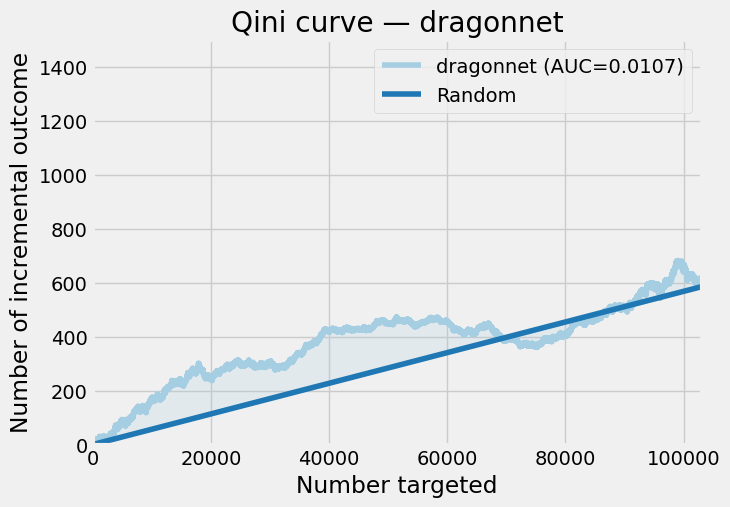

</td>

<td valign="top">

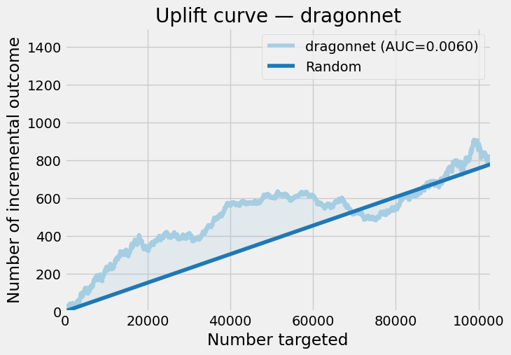

</td>

</tr>
</table>

## Результаты

| **model**              | **qini_auc** | **uplift_auc** | **uplift@5** | **uplift@10** | **uplift@30** | **profit@5** | **profit@10** | **profit@30** |
| ---------------------- | -----------: | -------------: | -----------: | ------------: | ------------: | -----------: | ------------: | ------------: |
| `class_transformation` |   **0.0325** |     **0.0195** |      -0.0067 |    **0.0463** |    **0.0277** |      -94 539 |    **83 731** |   **-35 883** |
| `cfrnet_mmd`           |   **0.0245** |     **0.0134** |       0.0143 |    **0.0249** |    **0.0158** |      -40 320 |   **-26 492** |  **-219 541** |
| `uplift_random_forest` |   **0.0236** |     **0.0131** |   **0.0323** |        0.0226 |    **0.0207** |    **5 884** |       -38 263 |  **-144 493** |
| `s_learner`            |       0.0190 |         0.0104 |       0.0202 |    **0.0324** |        0.0115 |      -25 243 |    **12 550** |      -285 196 |
| `t_learner`            |       0.0132 |         0.0072 |       0.0038 |        0.0093 |        0.0123 |      -67 496 |      -106 704 |      -274 012 |
| `tarnet`               |       0.0117 |         0.0064 |       0.0057 |        0.0076 |        0.0130 |      -62 704 |      -115 344 |      -262 462 |
| `dragonnet`            |       0.0107 |         0.0060 |   **0.0210** |        0.0219 |        0.0121 |  **-23 272** |       -41 935 |      -276 481 |
| `response_model`       |       0.0094 |         0.0051 |       0.0186 |        0.0223 |        0.0111 |      -29 280 |       -39 591 |      -291 596 |
| `dr_learner`           |       0.0083 |         0.0045 |   **0.0457** |        0.0192 |        0.0113 |   **40 368** |       -55 506 |      -288 408 |
| `x_learner`            |       0.0034 |         0.0018 |       0.0130 |       -0.0018 |        0.0119 |      -43 880 |      -164 036 |      -279 163 |
| `transformed_outcome`  |       0.0005 |        -0.0002 |       0.0121 |        0.0020 |        0.0073 |      -46 230 |      -144 487 |      -351 348 |
| `random`               |      -0.0027 |        -0.0015 |       0.0135 |        0.0125 |        0.0105 |      -42 598 |       -90 378 |      -301 004 |


Лучшие с точки зрения ранжирования:

- `Class Transformation`
- `CFRNet + MMD Loss`
- `Uplift Random Forest`

# Выбор и обучение модели

В качестве двух основных моделей выбираем:

- `Class Transformation` (Classiс ML подход на основе бустинга). При этом предсказанное значение uplift для модели не откалибровано, она может использоваться только при ранжировании


- `CFRNet + MMD Loss` (DL подход для более сложных зависимостей и сильных различиях Test/Control)

При этом у `Class Transformation` проседает uplift на top-5% сегменте. При узком таргетинге нужна еще одна модель, которая хорошо выберет лучшие 5% клиентов

Можно рассмотреть `Uplift Random Forest` с большим количеством деревьев, но тюнинг и обучение займут слишком много времени

Поэтому на этапе MVP приложения попробуем `DR-Learner`, показавший самый высокий uplift на top-5% клиентов (но менее стабильный на остальных). Обучение и инференс будут быстрее


## Tuning+CV

**Датасет для обучения:** 

Train + Test использовавшийся для локального сравнения моделей

Итого: 584К строк

**Подбор гиперпараметров**

Хотим уложиться в 30мин на подбор гиперпараметров для одной модели. 

`Class Transformation`

- В две итерации сравниваем между собой 10 конфигураций, выбираем лучшую с точки зрения ранжирования по Qini AUC

`DR-Learner`

- В две итерации сравниваем между собой 5 конфигураций (для 2 моделей), выбираем лучшую с точки зрения узкого таргетинга по uplift@5

`CFRNet + MMD Loss`

- В две итерации сравниваем между собой 3 конфигурации. Выбираем лучшую по Qini AUC. Для первого приближения учим на 5 эпохах (эмпирически этого хватало). Финальную модель учим на 10 эпох при patience=3 (обычно обучение останавливало на 9-й эпохе)

**Кросс-Валидация**

- Stratified `K-Fold (K=3)` для каждой конфигурации гиперпараметров.

Финальные лучшие модели учим на всем датасете

## Финальные модели

**1. Class Transformation**

| Параметр | Значение |
|---|---:|
| `iterations` | `1200` |
| `depth` | `5` |
| `learning_rate` | `0.025` |
| `l2_leaf_reg` | `20` |

---

**2. DR-Learner**

Outcome model

| Параметр | Значение |
|---|---:|
| `iterations` | `700` |
| `depth` | `6` |
| `learning_rate` | `0.035` |
| `l2_leaf_reg` | `20` |

Tau model

| Параметр | Значение |
|---|---:|
| `iterations` | `700` |
| `depth` | `5` |
| `learning_rate` | `0.03` |
| `l2_leaf_reg` | `30` |

---

**3. CFRNet + MMD Loss**

| Параметр | Значение |
|---|---:|
| `hidden_dims` | `(512, 256, 128)` |
| `dropout` | `0.15` |
| `lr` | `0.001` |
| `weight_decay` | `0.0001` |
| `batch_size` | `16384` |
| `epochs` | `10` |
| `patience` | `3` |
| `val_size` | `0.1` |
| `mmd_weight` | `0.025` |
| `mmd_sample_size` | `512` |
| `random_state` | `42` |
| `verbose` | `False` |
